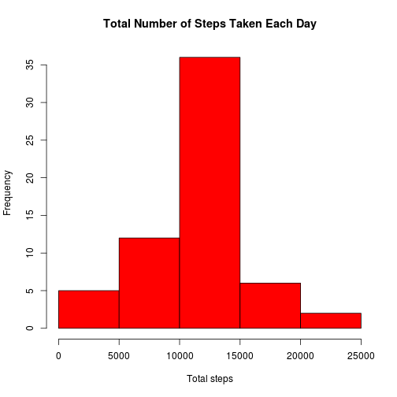

# Reproducible Research: Peer Assessment 1


## Loading and preprocessing the data

```r
unzip("activity.zip")
activity <- read.csv("activity.csv")
# processing the data turn the date variable into a date type variable
activity$date <- as.Date(activity$date)
```


## What is mean total number of steps taken per day?


```r
# total of steps taken per day
totalsteps <- with(activity, tapply(steps, as.factor(date), sum))
# 2.1 Histogram of the total number of steps taken each day
hist(totalsteps, main = "Total Number of Steps Taken Each Day", xlab = "Total steps", 
    col = "blue")
```

 

```r
# 2.2 the mean and median total number of steps taken per day Mean
mean(totalsteps, na.rm = T)
```

```
## [1] 10766
```

```r
# Median
median(totalsteps, na.rm = T)
```

```
## [1] 10765
```


## What is the average daily activity pattern?

```r
# time series plot
averageInterval <- aggregate(steps ~ interval, data = activity, mean)
with(averageInterval, plot(interval, steps, type = "l"))
title("Average steps taken across the 5-minutes interval")
```

 

```r
# maximum number steps
averageInterval[averageInterval$steps == max(averageInterval$steps), ]
```

```
##     interval steps
## 104      835 206.2
```


## Imputing missing values

```r
# 4.1 total number of missing values in the dataset
sum(is.na(activity))
```

```
## [1] 2304
```

```r

# 4.2 filling missindg data

# 4.3 data set without missing values
activity_no_missing <- activity
for (i in 1:length(activity_no_missing[, 1])) {
    if (is.na(activity_no_missing[i, 1])) {
        b <- activity_no_missing[activity_no_missing[, 3] == activity_no_missing[i, 
            3], ]
        activity_no_missing[i, 1] <- round(mean(b[, 1], na.rm = T))
    }
}

# 4.4 Histogram total of steps taken per day
totalsteps2 <- with(activity_no_missing, tapply(steps, as.factor(date), sum))
# 2.1 Histogram of the total number of steps taken each day
hist(totalsteps2, main = "Total Number of Steps Taken Each Day", xlab = "Total steps", 
    col = "red")
```

 

```r
# 2.2 the mean and median total number of steps taken per day Mean
mean(totalsteps2, na.rm = T)
```

```
## [1] 10766
```

```r
# Median
median(totalsteps2, na.rm = T)
```

```
## [1] 10762
```


## Are there differences in activity patterns between weekdays and weekends?

```r
for (i in 1:length(activity_no_missing[, 1])) {
    if (!(weekdays(activity_no_missing[i, 2]) %in% c("sábado", "domingo"))) {
        activity_no_missing[i, 4] <- "weekday"
    } else {
        activity_no_missing[i, 4] <- "weekend"
    }
}

activity_no_missing[, 4] <- as.factor(activity_no_missing[, 4])
colnames(activity_no_missing)[4] <- "weekdayOrWeekend"

averageIntervalWeek <- aggregate(steps ~ interval + weekdayOrWeekend, data = activity_no_missing, 
    mean)

library(lattice)
with(averageIntervalWeek, xyplot(round(steps) ~ interval | weekdayOrWeekend, 
    layout = c(1, 2), type = "l"))
```

 


