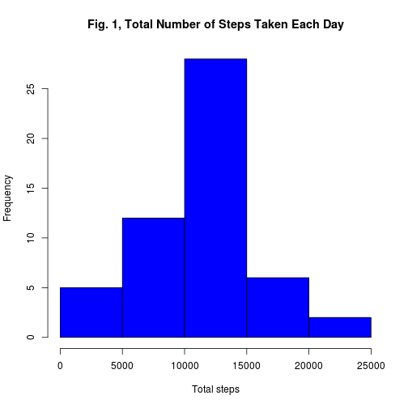
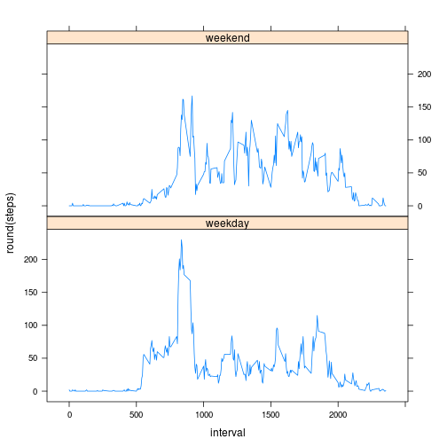
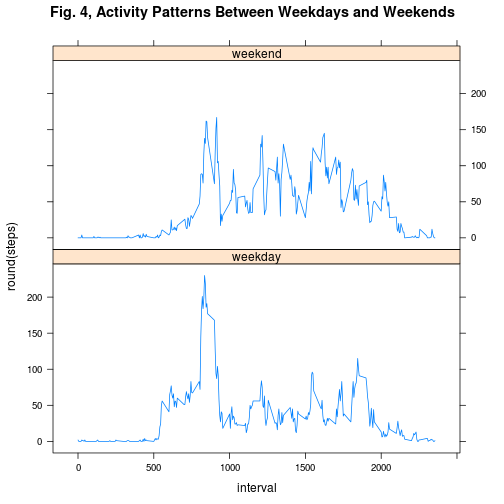

# Reproducible Research: Peer Assessment 1
For this assignment the data  was processed using R version 3.1.0 in linux Ubuntu 12.04

## Loading and preprocessing the data
The first pass which was taken to load the data in the work directory was to extract them from the zip file and then was read it using the read.csv command to stored them in a object called "activity" and the first preprocessing step was to convert  the variable "date" in to a date type variable.

```r
unzip("activity.zip")
activity <- read.csv("activity.csv")
# processing the data turn the date variable into a date type variable
activity$date <- as.Date(activity$date)
```


## What is mean total number of steps taken per day?
To answer this question was created a vector variable called "totalsteps" in which  every element is the sum  of  the steps taken each day, to do that  was used the tapply function to apply the function sum on the steps by date as factor variable.

```r
# total of steps taken per day
totalsteps <- with(activity, tapply(steps, as.factor(date), sum))
# Histogram of the total number of steps taken each day
hist(totalsteps, main = "Fig. 1, Total Number of Steps Taken Each Day", xlab = "Total steps", 
    col = "blue")
```

 

```r
# the mean and median total number of steps taken per day Mean of the total
# steps
tmean <- mean(totalsteps, na.rm = T)
# Median of the total steps
tmedian <- median(totalsteps, na.rm = T)
# setting inline output options to avoid the default scientific notation
options(scipen = 1, digits = 2)
```


The mean of the total steps taken per day is 10766.19 and its median is 10765.

## What is the average daily activity pattern?
the following plot shows the daily average number of steps in the data set across the 5-minute intervals in which the measurements were taken.
to construct this plot a new data frame was create in which the steps were averaged by the 5-minute intervals using the "aggregate" function.


```r
# time series plot
averageInterval <- aggregate(steps ~ interval, data = activity, mean)
with(averageInterval, plot(interval, steps, type = "l"))
title("Fig. 2, Average steps taken across the 5-minutes interval")
```

 

```r
# maximum number steps
maxsteps <- averageInterval[averageInterval$steps == max(averageInterval$steps), 
    ]
```

the interval 835 contains the maximum number of steps on average across all the days in the dataset in this case 206.17.


## Imputing missing values
For imputing the missing data was to check the number of missing values.

```r
# total number of missing values in the dataset
sum(is.na(activity))
```

```
## [1] 2304
```

To fill the missing values every value in the variable steps in the data set called "activity" was checked if it was a NA value and in case true the NA was changed by the average number of steps in the 5-minute interval, the new data without the missing values was stored in a dataframe called "activity_no_missing".

```r
# filling missindg data

# data set without missing values
activity_no_missing <- activity
for (i in 1:length(activity_no_missing[, 1])) {
    if (is.na(activity_no_missing[i, 1])) {
        b <- activity_no_missing[activity_no_missing[, 3] == activity_no_missing[i, 
            3], ]
        activity_no_missing[i, 1] <- round(mean(b[, 1], na.rm = T))
    }
}

# Histogram total of steps taken per day
totalsteps2 <- with(activity_no_missing, tapply(steps, as.factor(date), sum))
# 2.1 Histogram of the total number of steps taken each day
hist(totalsteps2, main = "Fig. 3, Total Number of Steps Taken Each Day", xlab = "Total steps", 
    col = "red")
```

 

```r
# the mean and median total number of steps taken per day Mean
tnmean <- mean(totalsteps2, na.rm = T)
# Median
tnmedian <- median(totalsteps2, na.rm = T)
```

The mean of the total steps taken per day withot missing is 10765.64 and its median is 10762, These values  are not so different  to those with missing data, but the distribution of total steps increases around the central values.


## Are there differences in activity patterns between weekdays and weekends?

```r
for (i in 1:length(activity_no_missing[, 1])) {
    if (!(weekdays(activity_no_missing[i, 2]) %in% c("sábado", "domingo"))) {
        activity_no_missing[i, 4] <- "weekday"
    } else {
        activity_no_missing[i, 4] <- "weekend"
    }
}

activity_no_missing[, 4] <- as.factor(activity_no_missing[, 4])
colnames(activity_no_missing)[4] <- "weekdayOrWeekend"

averageIntervalWeek <- aggregate(steps ~ interval + weekdayOrWeekend, data = activity_no_missing, 
    mean)

library(lattice)
with(averageIntervalWeek, xyplot(round(steps) ~ interval | weekdayOrWeekend, 
    layout = c(1, 2), type = "l", main = "Fig. 4, Activity Patterns Between Weekdays and Weekends"))
```

 


